# R$^2$C$^2$-Coder

R$^{2}$C$^{2}$-Coder: Enhancing and Benchmarking Real-world Repository-level Code Completion Abilities of Code Large Language Models [[paper](https://arxiv.org/pdf/2406.01359)]

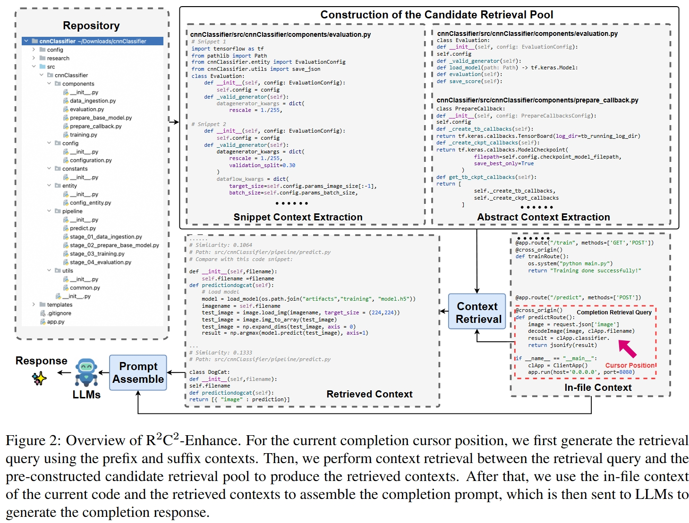

## Abstract

Recently, repository-level code completion has drawn more attention in modern software development, and several baseline methods and benchmarks have been proposed. However, existing repository-level code completion methods often fall short of fully using the extensive context of a project repository, such as the intricacies of relevant files and class hierarchies. Besides, the existing benchmarks usually focus on limited code completion scenarios, which cannot reflect the repository-level code completion abilities well of existing methods.
To address these limitations, we propose the R$^2$C$^2$-Coder to enhance and benchmark the real-world repository-level code completion abilities of code Large Language Models, where the R$^2$C$^2$-Coder includes a code prompt construction method R$^2$C$^2$-Enhance and a well-designed benchmark  R$^2$C$^2$-Bench. Specifically, first, in R$^2$C$^2$-Enhance, we first construct the candidate retrieval pool and then assemble the completion prompt by retrieving from the retrieval pool for each completion cursor position. Second, based on R$^2$C$^2$-Enhance,
we can construct a more challenging and diverse R$^2$C$^2$-Bench with training, validation and test splits, where a context perturbation strategy is proposed to simulate the real-world repository-level code completion well. Extensive results on multiple benchmarks demonstrate the effectiveness of our R$^2$C$^2$-Coder.

## R$^2$C$^2$-Coder

### R$^2$C$^2$-Enhance

Given a repository, we extract **abstract** and **snippet** contexts to construct the candidate retrieval pool.

#### Abstract Extraction

@dengken

#### Snippet Extraction

For the snippet context, we iteratively scan the files in the repository and extract contiguous $M$ (default: 10) lines of overlapping code fragments, which are the candidates for context retrieval.

#### Retrieval

For the current cursor position, we take the previous $P$ lines and subsequent $S$ lines as the prefix and suffix contexts, respectively. We apply a retriever such as BM25  to find corresponding abstract contexts and snippet contexts. We preserve the top-$K$ similar abstract contexts then append the most relevant snippet context based on the similarity scores until the maximum number of tokens is $N$ (default: 4096).

### R$^2$C$^2$-Bench

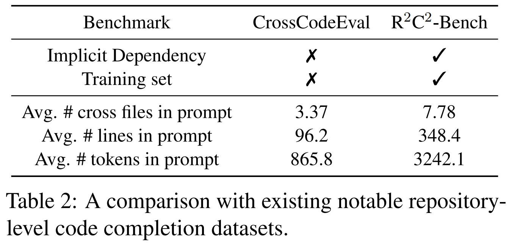

#### Preparaion

We collected permissively licensed repositories from GitHub between 2023-09-06 and 2023-12-06, focusing on four languages and repositories with at least 3 stars. Repositories with fewer than 10 or more than 50 source code files, or those with files identical to any in the Stack dataset, were excluded. This resulted in 54,972 Python, 51,796 Java, 49,790 TypeScript, and 35,410 C# repositories.

Using R$^2$C$^2$-Enhance, we generate completion prompts by selecting a random node from the abstract syntax tree (AST) of each file as the cursor position. A completion prompt is then generated based on this position.

To simulate real-world code completion, we introduced a context perturbation strategy. For $Q%$ of cursor positions (default $Q=10$), we discard $R%$ of similar contexts and use the remaining contexts to generate the completion prompt. This process results in 400,000 training samples (100,000 per language). We also apply rule-based and model-based filters to ensure the quality of validation and testing samples in R$^2$C$^2$-Bench.

#### Statistics

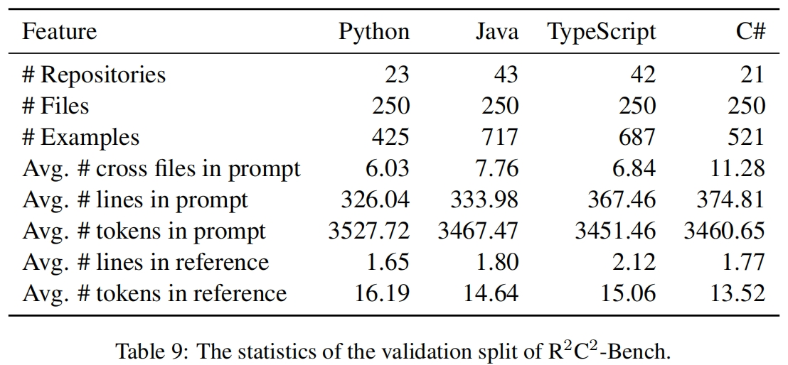
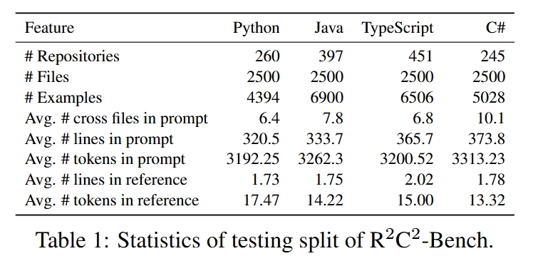

## Experimental Results

### Main

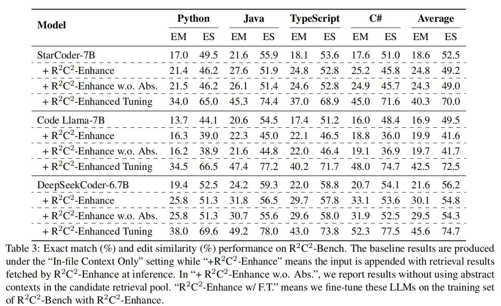
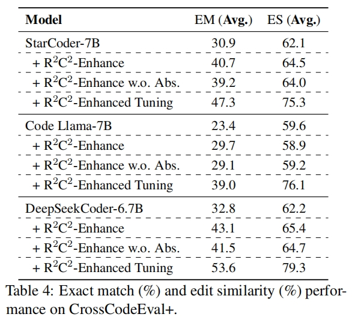
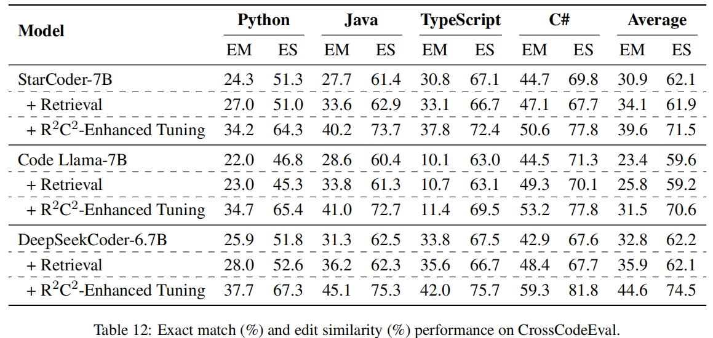

### Ablation

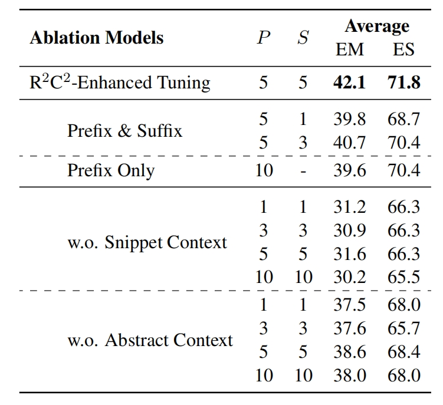
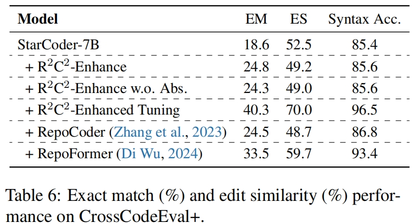
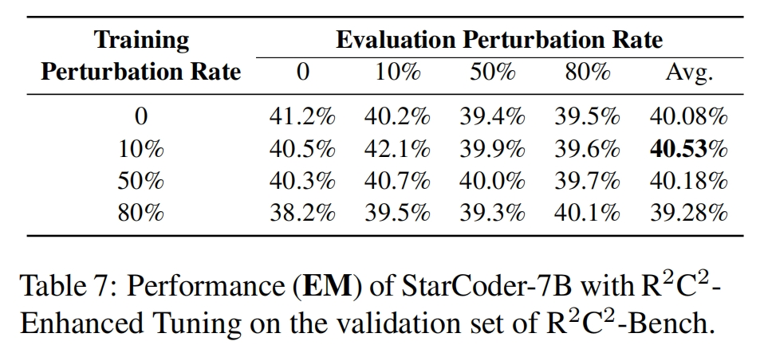
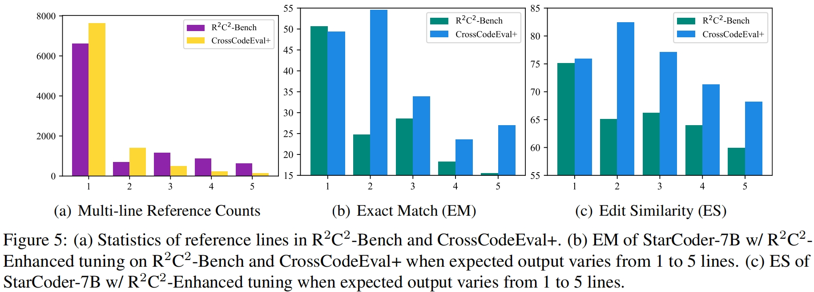
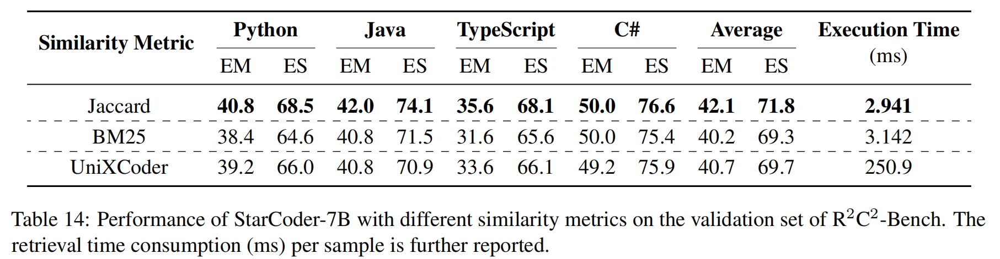
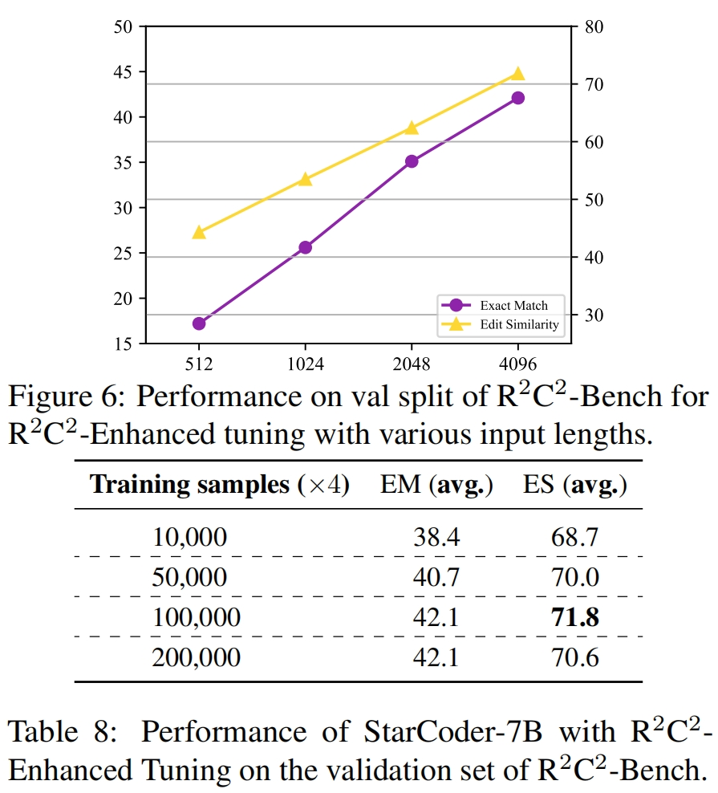
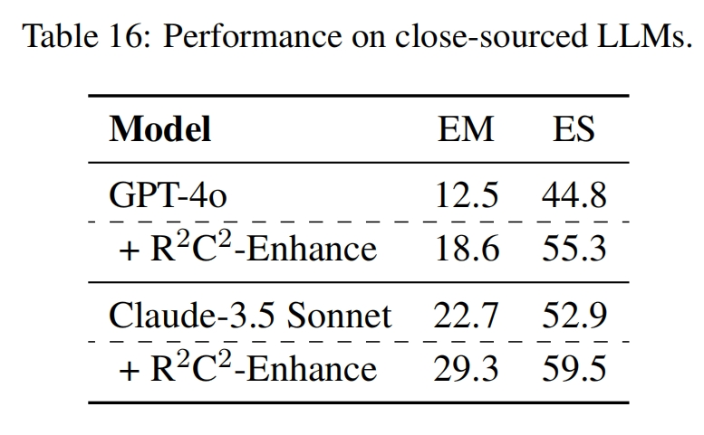

## Run

@dengken

## Citation

```
@article{deng2024r2c2,
  title={R2C2-Coder: Enhancing and Benchmarking Real-world Repository-level Code Completion Abilities of Code Large Language Models},
  author={Deng, Ken and Liu, Jiaheng and Zhu, He and Liu, Congnan and Li, Jingxin and Wang, Jiakai and Zhao, Peng and Zhang, Chenchen and Wu, Yanan and Yin, Xueqiao and others},
  journal={arXiv preprint arXiv:2406.01359},
  year={2024}
}
```
